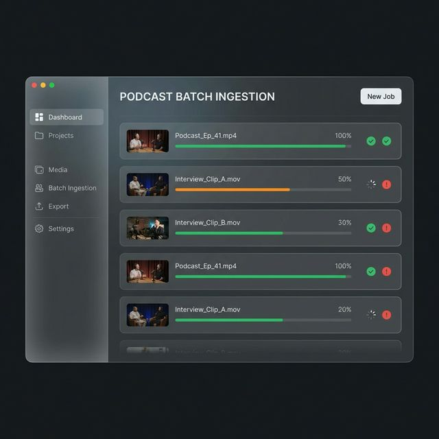
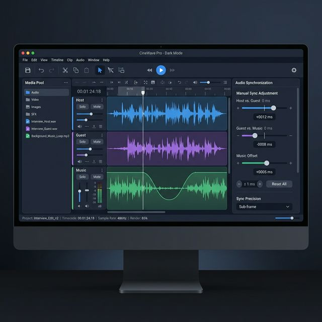
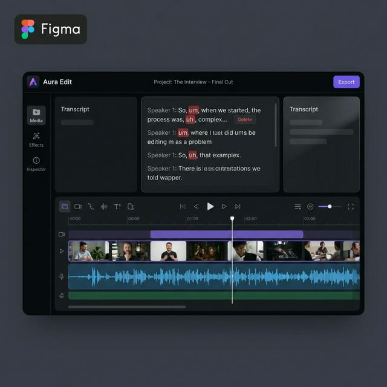
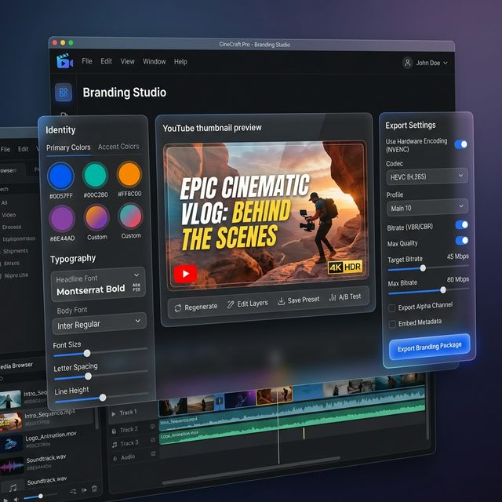

# Phase 10: Tauri Desktop Application Specification

This document outlines the architecture, UX/UI requirements, and feature-parity matrix for building a standalone Desktop Application using **Tauri v2** for the Podcast Pipeline.

The goal is to provide a premium, native Desktop experience that **strictly encompasses all current Streamlit features**, while leveraging native OS capabilities for advanced workflow enhancements.

## 1. Architectural Strategy: The "Sidecar" Model
To ensure we maintain *both* the Streamlit Web App and the Tauri Desktop App without duplicating code:
*   **The Engine (Python):** `src/podcast_pipeline` module remains the uncompromised source of truth.
*   **The Bridge (FastAPI):** We wrap the core pipeline in a lightweight FastAPI server that accepts JSON requests and streams execution logs via WebSockets.
*   **The Web UI (Streamlit):** Continues to run perfectly, importing Python logic directly.
*   **The Desktop UI (Tauri + React/Vue):** Tauri (Rust shell) securely boots the FastAPI Python executable in the background (via `stdin/stdout` lifecycle hooks) and communicates with it via REST.

---

## 2. Feature Parity Matrix (Streamlit → Desktop UX)

The Desktop App must port over every single Streamlit feature, organized into a professional NLE (Non-Linear Editor) layout.

| Core System Feature | Current Streamlit UX | Desktop Target UX (Tauri) |
| :--- | :--- | :--- |
| **Project Ingestion** | Basic file uploader / folder path text input | Native OS drag-and-drop file targets. Batch ingestion visual queue with progress bars. |
| **Pipeline Runner** | Sequential spinners and expanders | High-fidelity dashboard mapping each pipeline stage (Analyze, Sync, Cut, Encode) to parallel progress bars. |
| **Filler Word Overrides** | DataFrame table with Keep/Remove dropdowns | Interactive scrolling transcript. AI-flagged 'um/uh' targets highlighted in red. Clicking a word toggles its cut state. |
| **Smart Bridging Options** | Select-boxes for Micro-fade / RIFE | Visual dropdowns attached to the timeline track headers. |
| **Audio Sync Adjustments** | Numeric input slider (±5000ms) | Multi-track audio timeline visualizing waveforms. Left/Right pan sliders attached directly to track heads. |
| **Brand Studio Profiles** | Deep vertical list of inputs and dropdowns | Dedicated 'Studio' modal. Interactive color swatches, systemic font dropdowns. |
| **AI Thumbnails** | Streamlit `st.image` preview and toggle | Deep integration. Large canvas preview, "Regenerate" prompt wands using Gemini Vision API. |
| **Export Profile Specs** | Dropdown (youtube_ultra, twitter) | Dedicated "Export Settings" sidebar with toggles for NVENC HEVC hardware encoding limits. |

---

## 3. UI/UX Design Mockups

**Design Aesthetic:** "Figma-Grade Pro App". Deep dark mode, subtle glassmorphism layers, flat vector UI widgets, and Dribbble-quality clean typography.

### View 1: Job Ingestion & Pipeline Dashboard
**Purpose:** Replace Streamlit's basic uploaders with a native batch ingestion queue.
**Desktop Exclusive Features:** Native OS file system drag-and-drop, persistent project history, parallel job execution visualization.

### View 2: Audio Sync & Auto-Ducking Editor
**Purpose:** Replaces Streamlit's slider lists with an actual timeline representation.
**Desktop Exclusive Features:** Visual waveform representations of the Host, Guest, and Music. You can visually see the `sidechaincompress` auto-ducking curves dipping the music when the host speaks.

### View 3: Transcript & Filler Cut Timeline
**Purpose:** Replaces Streamlit's data-grid filler word review.
**Desktop UX:** A scrolling transcript directly above the video feed. AI-flagged filler words (Um, Uh, Like) are highlighted in red. The operator clicks the word to instantly toggle it from `Remove` back to `Keep`.

### View 4: Branding Studio & NVENC Export
**Purpose:** The ultimate branding and packaging window.
**Desktop UX:** Replaces the heavy vertical scrolling Streamlit sidebar. This view centralizes Color Swatches, Font Selection, AI Thumbnail Previews, and the final Export toggles (Codec, NVENC vs Software, Target Bitrate).

---

## 4. Implementation Details (Phase 10 Draft)

1.  **FastAPI Sidecar (10-01):** Wrap existing pipeline functions into clean REST endpoints.
2.  **PyInstaller (10-02):** Configure `pyinstaller --onefile` to bundle FastAPI, OpenCV, and Torch into a single headless OS binary.
3.  **Tauri Workspace (10-03):** Configure Tauri `bundle.externalBin` to package the compiled Python binary and map the `stdin` shutdown hook.
4.  **Frontend Tokens (10-04):** Set up React, TailwindCSS, and the Dark Mode Glassmorphism UI components.
5.  **Dashboard Integration (10-05):** Build the ingestion screen (View 1) and WebSockets for NVENC encoding progress.
6.  **Timeline Integration (10-06):** Integrate Wavesurfer.js mapping to FFmpeg JSON probe data (View 2 & 3).
7.  **Studio Integration (10-07):** Build the Branding CRUD UI and Export settings hooks (View 4).
8.  **Distribution (10-08):** Configure CI/CD to export `.exe`, `.dmg`, and `.AppImage`.
